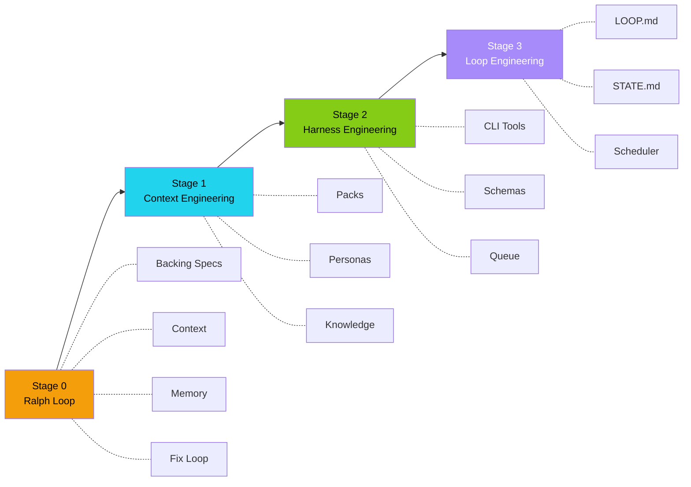

# Architecture — agentic-harness

> Visual overview of the agentic-harness component architecture and data flow.
> This repo is the **Workspace Layer** — a persistent reference workspace powered by **agent-toolkit** (Capability Layer). It is not a second runtime.


---

## High-Level Architecture

```mermaid
graph TB
    subgraph "User / AI Tool"
        AI[Claude Code / opencode / Cursor / Copilot / Gemini CLI]
    end

    subgraph "Stage 1 — Context"
        AGENTS[AGENTS.md<br/>Routing Table]
        PACKS[packs/*.yaml<br/>Workspace Context Bundles]
        PERSONAS[personas/*.md<br/>Workspace Persona Selections]
        PROFILES[profiles/*.yaml<br/>Session Bundles]
        KNOWLEDGE[knowledge/<br/>Persistent Memory]
    end

    subgraph "Stage 2 — Harness"
        WCTX[agent-toolkit workspace<br/>Session Snapshot]
        AMEM[agent-toolkit memory<br/>Knowledge CLI]
        DC[agent-toolkit devcompanion<br/>Job Queue]
        PI[agent-toolkit project<br/>Repo Manager]
        SCHEMAS[schemas/<br/>JSON Schema Validation]
    end

    subgraph "Stage 3 — Loops"
        LOOP[agent-toolkit loop<br/>Loop Orchestrator]
        TEMPLATES[templates/loops/<br/>Loop Templates]
        SCHEDULER[Scheduler<br/>systemd / launchd]
    end

    subgraph "Infrastructure"
        REPOS[repos/<br/>Cloned Projects]
        PROJS[projects/<br/>Symlinks]
        JOBS[templates/jobs/<br/>Job Templates]
        EXAMPLES[examples/<br/>Walkthroughs]
    end

    subgraph "External"
        TK[agent-toolkit<br/>Capability Layer — skills, agents, CLIs]
        GIT[GitHub / GitLab<br/>Repositories]
    end

    AI --> AGENTS
    AGENTS --> WCTX
    WCTX --> PACKS
    WCTX --> PERSONAS
    WCTX --> PROFILES
    WCTX --> KNOWLEDGE
    WCTX --> TK

    AI --> AMEM
    AMEM --> KNOWLEDGE

    AI --> DC
    DC --> JOBS
    DC --> TK

    AI --> PI
    PI --> REPOS
    PI --> PROJS
    PI --> GIT

    AI --> LOOP
    LOOP --> TEMPLATES
    LOOP --> SCHEDULER
    LOOP --> WCTX
    LOOP --> AMEM

    SCHEMAS --> PACKS
    SCHEMAS --> PERSONAS
    SCHEMAS --> PROFILES
    SCHEMAS --> KNOWLEDGE
    SCHEMAS --> TEMPLATES

    style AI fill:#a78bfa,stroke:#7c3aed,color:#fff
    style AGENTS fill:#22d3ee,stroke:#06b6d4,color:#000
    style WCTX fill:#84cc16,stroke:#65a30d,color:#000
    style LOOP fill:#f59e0b,stroke:#d97706,color:#000
    style KNOWLEDGE fill:#ec4899,stroke:#db2777,color:#fff
    style TK fill:#6366f1,stroke:#4f46e5,color:#fff
```



> **Naming note:** Stages 1–3 are *discipline* stages (Context → Harness → Loop Engineering).
> Loop *tiers* L1/L2/L3 are a separate axis — they describe loop autonomy
> (report-only → PR-gated → unattended allowlist). See [docs/METHODOLOGY.md](METHODOLOGY.md) and [docs/LOOPS.md](LOOPS.md).

---

## Component Reference

### Stage 1 — Context Engineering

| Component | Location | Purpose |
|-----------|----------|---------|
| **AGENTS.md** | Repo root | Stateless orchestration rules, routing table, skill definitions |
| **Packs** | `packs/*.yaml` | Workspace context bundles: repos, IDs, conventions, LLM policy (distinct from Toolkit capability packs) |
| **Personas** | `personas/*.md` | Workspace persona selections (bindings to Toolkit's generic catalog) |
| **Profiles** | `profiles/*.yaml` | Bundled sessions combining pack + persona + skills |
| **Knowledge Base** | `knowledge/` | Persistent cross-session memory: learnings, processes, todos |

### Stage 2 — Harness Engineering

| Component | Location | Purpose |
|-----------|----------|---------|
| **agent-toolkit workspace** | `agent-toolkit workspace context` | Generates session snapshot: packs, personas, skills, knowledge |
| **agent-toolkit memory** | `agent-toolkit memory` | Search, add, inject, and review knowledge entries |
| **agent-toolkit devcompanion** | `agent-toolkit devcompanion` | Background job queue: code reviews, PRs, CI fixes, investigations |
| **agent-toolkit project** | `agent-toolkit project` | Clone repos and manage symlinks in projects/ |
| **Schema Validation** | `schemas/` | JSON Schema validation for all context surfaces |

> All CLIs in this table are shipped by **agent-toolkit**. The harness validates inputs and holds the durable state.

### Stage 3 — Loop Engineering

| Component | Location | Purpose |
|-----------|----------|---------|
| **loop** | `agent-toolkit loop` | Loop orchestrator: init, run, status, audit, cost estimation |
| **Loop Templates** | `templates/loops/` | Reusable templates: daily-triage, pr-babysitter, ci-sweeper, etc. |
| **Scheduler** | systemd / launchd | OS-level timer integration for autonomous execution |

---

## Data Flow

### Session Start

```text
1. AI reads AGENTS.md
   └─ Routing table → which skills to use for each task type

2. Load pack or profile
   └─ agent-toolkit workspace load --pack <name>
      └─ snapshot includes: repos, conventions, IDs, LLM policy

3. Prime context
   └─ agent-toolkit workspace context (snapshot)
   └─ agent-toolkit memory inject (knowledge entries)
```

### During Work

```text
4. Discover work via skill delegation
   └─ jira-assistant → find assigned issues
   └─ clickup-cli → check sprint backlog

5. Execute with sub-agents
   └─ planner → implementation plan
   └─ implementer → write code
   └─ code-reviewer → review changes

6. Save learnings
   └─ agent-toolkit memory add --type learning "pattern discovered"
```

### Between Sessions

```text
7. Loops run autonomously (if scheduled)
   └─ agent-toolkit loop run daily-triage
      └─ scans issues → updates STATE.md → applies exit conditions

8. Dev companion processes queue
   └─ agent-toolkit devcompanion run-once
      └─ picks up queued jobs → runs LLM-powered worker → updates status
```

---

## Discipline Stages



Each stage can be adopted independently. You can use context engineering without loops. To get autonomous loops, you need all three.

> **Loop tiers vs Stages:** Loop tiers L1/L2/L3 (report-only / PR-gated / unattended) are orthogonal to Stages. A Stage 3 loop can run at any tier — tier describes *autonomy*, Stage describes *discipline*. See [docs/LOOPS.md](LOOPS.md#rollout-tiers).

---

## External Dependencies

| System | Integration | Where |
|--------|------------|-------|
| **agent-toolkit** | Skills, agents, loop/queue/memory/project CLIs | Capability Layer — `agent-toolkit` CLI |
| **agentic-workstation** | Machine provisioning, Herdr/tmux, dotfiles | Infrastructure Layer |
| **GitHub** | Repositories, PRs, issues | Via `gh` CLI + `agent-toolkit project` |
| **GitLab** | Repositories, MRs, issues | Via `glab` CLI + `agent-toolkit project` |
| **Jira / ClickUp / Linear** | Task management | Via skills from agent-toolkit |
| **systemd / launchd** | Loop scheduling | OS-level timer units / plists |
