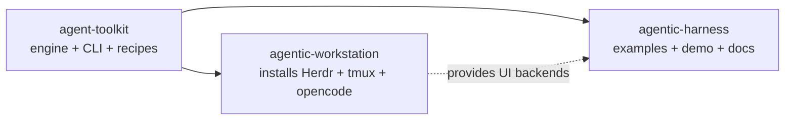

# Swarms in agentic-harness — Reference Workspace

This harness is the **Workspace Layer reference** for Agent Toolkit Swarms. It shows
how to use `agent-toolkit swarm`, not how to implement it.

**Ownership:** `agent-toolkit` owns the engine; `agentic-workstation` installs
`tmux`/`Herdr`/`opencode` integration; `agentic-harness` shows examples and a
sanitized offline demo. Filesystem state under `.agent-toolkit/swarm/` is
authoritative — no cloud required.

---

## Three-Repo Architecture

| Repo | Role | What it owns |
|------|------|--------------|
| [`agent-toolkit`](https://github.com/ulises-jeremias/agent-toolkit) | **Engine** | Swarm runtime, recipes, handoffs, budgets, runners, Herdr/tmux adapters, prompts, artifacts. Sole source of truth. |
| [`agentic-workstation`](https://github.com/ulises-jeremias/agentic-workstation) | **Installer** | Installs `tmux`, `Herdr`, `opencode` integration, dotfiles glue. No orchestration. |
| `agentic-harness` (this repo) | **Reference workspace** | Sample `swarm.yaml`, recipe overrides, `examples/swarms/*`, `docs/SWARMS.md`, `scripts/demo-swarm.sh`. No engine code. |



For full runtime layers, state files, and state machines see
`agent-toolkit` docs:
[`SWARM_ARCHITECTURE.md`](https://github.com/ulises-jeremias/agent-toolkit/blob/main/docs/SWARM_ARCHITECTURE.md),
[`SWARM_HANDOFFS.md`](https://github.com/ulises-jeremias/agent-toolkit/blob/main/docs/SWARM_HANDOFFS.md),
[`SWARM_SECURITY.md`](https://github.com/ulises-jeremias/agent-toolkit/blob/main/docs/SWARM_SECURITY.md).

### Layout in this repo

```text
agentic-harness/
  .agent-toolkit/swarm.yaml        # sample local config — copy & edit
  swarms/{pair,team,full}.yaml     # example recipe overrides (optional)
  examples/swarms/
    fix-a-bug/                     # pair — bug fix, sanitized artifacts
    implement-a-feature/           # team — feature with plan gate
    review-and-refactor/           # full — high-risk with conditional hardener
  docs/SWARMS.md                   # this file
  scripts/demo-swarm.sh            # offline fake-runner demo (no LLM cost)
```

---

## Install Dependencies via Workstation

`agentic-workstation` provisions everything needed for swarms:

```bash
# Workstation-managed install (recommended)
chezmoi update
dots-doctor
herdr --version; tmux -V
herdr integration list --json  # check opencode
agent-toolkit swarm doctor     # verify runners + backends
agent-toolkit swarm doctor --json
```

Or manually:

```bash
# Herdr: https://herdr.dev/docs/install/
curl -fsSL https://herdr.dev/install.sh | sh
herdr --version

# tmux
brew install tmux        # macOS
sudo apt install tmux    # Debian/Ubuntu
tmux -V

# opencode runner
npm install -g opencode  # or see https://opencode.ai
opencode --version
opencode models          # list available models
```

`agent-toolkit swarm doctor` reports `herdr available`, `version`, and
`opencode integration installed/outdated`. If Herdr is missing and
`--ui auto` is used, the CLI falls back to `tmux` with guidance; with
`--ui herdr` it errors explicitly.

---

## Herdr vs tmux

Choose UI backend per run via `--ui herdr|tmux|auto`. Business logic,
worktrees, handoffs, budgets, and approvals are identical regardless of UI.

| Dimension | **Herdr** (recommended) | **tmux** (portable) |
|-----------|-------------------------|---------------------|
| Display | Native Herdr workspaces, panes, session replay | Isolated `tmux` server `agent-toolkit-swarm-<run-id>` |
| Install | `herdr` + `herdr integration install opencode` | `tmux` only |
| Best for | Desktop, recording, multi-pane observability | SSH, headless, CI, servers |
| Attach | `agent-toolkit swarm attach <run-id>` or `herdr workspace open swarm-<run-id>` | `agent-toolkit swarm attach <run-id>` or `tmux -L agent-toolkit-swarm-<run-id> attach -t swarm-<run-id>` |
| Degradation | `--ui auto` falls back to tmux if Herdr missing | Works anywhere `tmux` exists |
| Herdr-only error | `Herdr was explicitly requested but was not found.` | — |

### Run via Herdr (recommended)

```bash
agent-toolkit swarm doctor
agent-toolkit swarm start --recipe pair --ui herdr --runner opencode --model-profile balanced "Fix auth cache TTL"
agent-toolkit swarm status <run-id>
agent-toolkit swarm handoffs <run-id>
agent-toolkit swarm report <run-id>
```

Herdr plugin (thin, no orchestration logic):

```bash
# From agent-toolkit repo
herdr plugin link ./integrations/herdr/agent-toolkit-swarm
# Install from registry
herdr plugin install ulises-jeremias/agent-toolkit/integrations/herdr/agent-toolkit-swarm
```

### Run via tmux (portable, SSH-friendly)

```bash
agent-toolkit swarm start --recipe pair --ui tmux --runner opencode "Fix auth cache TTL"
agent-toolkit swarm attach <run-id>
# Manual attach
tmux -L agent-toolkit-swarm-<run-id> attach -t swarm-<run-id>
```

The harness never mutates your existing `tmux` sessions — each run uses its
own socket. See `agent-toolkit` docs:
[`SWARM_HERDR.md`](https://github.com/ulises-jeremias/agent-toolkit/blob/main/docs/SWARM_HERDR.md)
and
[`SWARM_TMUX.md`](https://github.com/ulises-jeremias/agent-toolkit/blob/main/docs/SWARM_TMUX.md).

---

## OpenCode Runner

**OpenCode** is the primary runner for swarms in this harness. It is installed
and wired via `agentic-workstation` (`herdr integration install opencode`).

```bash
agent-toolkit swarm start --recipe pair --runner opencode --model-profile balanced "Task"
agent-toolkit swarm models --runner opencode
agent-toolkit swarm models --runner opencode --profile balanced --json
opencode models  # runner-native discovery
```

- Other runners work identically (`--runner claude|codex|cursor|copilot|muse`), but examples and `scripts/demo-swarm.sh` use `opencode` and `skeleton`.
- `skeleton` is the offline fake runner — no LLM call, `0 tokens, $0.00`, ideal for CI, docs, and recording prep (see [Demo](#demo-no-llm-cost)).
- Validate `provider/model` format before start; per-role model override is allowed via config.
- Pricing is stored separately and updateable; unknown pricing is reported honestly, never silently swapped.

---

## Models & Model Profiles

Semantic profiles map task classes to `provider/model`. Task classes are
`planning`, `coding`, `review`, `architecture`, `hardening`, `qa`.

| Profile | Intent |
|---------|--------|
| `economy` | Cheap, fast |
| `balanced` | Default — mix of reasoning and cost |
| `quality` | Strongest reasoning |
| `private` | Local `ollama/*` models, no external data |

### Mapping example (`balanced`)

```yaml
model_profiles:
  balanced:
    planning: anthropic/claude-sonnet-4-20250514
    coding: anthropic/claude-sonnet-4-20250514
    review: openai/gpt-4o
    architecture: anthropic/claude-sonnet-4-20250514
    hardening: openai/gpt-4o
    qa: anthropic/claude-3-5-haiku-20241022
```

- Different provider for `review` reduces correlated mistakes.
- Override per role in `.agent-toolkit/swarm.yaml` or via recipe override.
- If a model is unavailable, the toolkit reports honestly and asks for explicit
  approval before switching to an expensive fallback:

```text
Current model unavailable.
Configured fallback changes estimated cost from $X to $Y.
Explicit approval required.
```

- If pricing is unknown: `Pricing unavailable, estimate not calculated.`

Full spec: [`SWARM_MODELS_AND_COSTS.md`](https://github.com/ulises-jeremias/agent-toolkit/blob/main/docs/SWARM_MODELS_AND_COSTS.md).

---

## Budgets

Limits are enforced per run; hitting a limit stops launching new work but
preserves a resumable `budget_exhausted` state with a partial report.

| Limit | Key | Default | Notes |
|-------|-----|---------|-------|
| Total tokens | `max_total_tokens` | `300000` (pair), `600000` (team), `900000` (full) | Includes input+output |
| Cost | `max_cost_usd` | `1.00` / `2.00` / `4.00` | Per profile pricing |
| Wall clock | `max_wall_seconds` | `7200` | Whole run |
| Concurrency | `max_concurrency` | `2` | Simultaneous agents |
| Round-trips | `max_role_round_trips` | `2` | e.g., reviewer → implementer feedback loops |
| Per-role tokens | `per_role.<role>.max_tokens` | — | Optional |

Configure via recipe (`swarms/*.yaml`), `.agent-toolkit/swarm.yaml`, or CLI.
On exhaustion the run stays inspectable and resumable. See [Resume](#resume-pause--promotion).

```yaml
# swarms/pair.yaml excerpt
budget:
  max_total_tokens: 300000
  max_cost_usd: 1.00
execution:
  max_concurrency: 2
  max_role_round_trips: 2
```

---

## Observe & Approve

```bash
agent-toolkit swarm list
agent-toolkit swarm status <run-id>
agent-toolkit swarm status <run-id> --json
agent-toolkit swarm watch <run-id>
agent-toolkit swarm approvals <run-id>
agent-toolkit swarm approve <run-id> plan   # for team/full plan gates
agent-toolkit swarm approve <run-id> final  # before base merge (no auto-merge)
agent-toolkit swarm reject <run-id> plan --reason "needs more scope"
```

- `team` and `full` require `plan` approval after `planner`; all recipes require
  `final` approval before any base-branch merge (auto-merge is never enabled).
- Machine-readable JSON is available for `status`, `handoffs`, and `report`.

---

## Resume, Pause & Promotion

Swarms are resumable. Filesystem state is authoritative.

```bash
# Pause / stop (state preserved, agents stopped)
agent-toolkit swarm stop <run-id>
agent-toolkit swarm pause <run-id>

# Resume from paused, budget_exhausted, or failed
agent-toolkit swarm resume <run-id>

# Inspect why it stopped
agent-toolkit swarm status <run-id> --json
cat .agent-toolkit/swarm/runs/<run-id>/trace.jsonl
cat .agent-toolkit/swarm/runs/<run-id>/budget.json
```

### When resume is needed

- **Budget exhausted** — hit `max_total_tokens`, `max_cost_usd`, or wall-clock;
  run enters `budget_exhausted`. Raise the budget and `resume`.
- **Round-trip limit** — e.g., `The reviewer returned blocking feedback twice.
  The configured round-trip limit has been reached.` Inspect artifacts/handoffs,
  then `resume` with a higher `max_role_round_trips`, promote, or fix manually.
- **Manual pause** — `stop`/`pause` keeps worktrees, handoffs, and trace.
- **Failure** — `failed` handoffs are preserved with diagnostics; fix and `resume`.

### Promotion

Escalate without losing run ID, branches, trace, or budget accounting:

```bash
agent-toolkit swarm promote <run-id> --to team
agent-toolkit swarm promote <run-id> --to full
```

Example: start as `team`, architect detects security risk → promote to `full`.
See [`examples/swarms/review-and-refactor/`](../../examples/swarms/review-and-refactor/README.md).

Reuses `loop/budget.py` primitives where possible. Run state machine:
`planning → awaiting_plan_approval → running → awaiting_human|paused|budget_exhausted|completed → cleanup_pending`.

---

## Inspect Artifacts & Logs

Each run lives under `.agent-toolkit/swarm/runs/<run-id>/`:

```text
.agent-toolkit/swarm/runs/<run-id>/
  run.yaml
  state.json            # versioned, atomic
  trace.jsonl           # append-only events
  budget.json
  ownership.json
  approvals.json
  artifacts/            # task-contract.md, implementation-report.md, final-report.md, ...
  handoffs/{outbox,queued,active,completed,failed}/<id>.json
  prompts/
  worktrees/<role>/     # Git worktrees, branch agent-toolkit-swarm/<run-id>/<role>
  runner/opencode/agents/
  logs/
```

```bash
# Artifacts & handoffs
agent-toolkit swarm artifacts <run-id>
agent-toolkit swarm handoffs <run-id> --json
agent-toolkit swarm handoff create --type artifact --from planner --to implementer --artifact artifacts/task-contract.md --run-id <run-id>
agent-toolkit swarm task next --role reviewer --run-id <run-id>
agent-toolkit swarm task complete --handoff <id> --run-id <run-id>

# Logs & trace
agent-toolkit swarm logs <run-id> implementer
cat .agent-toolkit/swarm/runs/<run-id>/trace.jsonl
cat .agent-toolkit/swarm/runs/<run-id>/artifacts/final-report.md
cat .agent-toolkit/swarm/runs/<run-id>/budget.json

# Report (machine-readable: report --json)
agent-toolkit swarm report <run-id>
```

No upload, no telemetry. Handoffs use validated full 40-char commit SHAs
(never uncommitted code), atomic tmpfile+rename writes, path containment,
and `1MB` artifact limit with secret redaction.

---

## Cleanup

```bash
agent-toolkit swarm cleanup <run-id> --dry-run
agent-toolkit swarm cleanup <run-id>          # refuses dirty worktrees, never deletes branches
agent-toolkit swarm cleanup <run-id> --force   # only if you intend to discard uncommitted work
```

- Only removes Toolkit-owned worktrees under `.agent-toolkit/swarm/runs/<run-id>/worktrees/`.
- Checks `git status --porcelain`; refuses dirty worktrees without `--force`.
- **Never deletes branches** (`agent-toolkit-swarm/<run-id>/<role>` are preserved).
- **Never auto-merges** to base; human `approve <run-id> final` is required.
- Path containment prevents symlink escapes; fails closed when ownership unclear.
- After cleanup, branches remain for manual inspection or `git branch -D`.

---

## Demo (no LLM cost)

[`scripts/demo-swarm.sh`](../../scripts/demo-swarm.sh) runs an offline
end-to-end demo with the `skeleton` runner — no API keys, no token spend,
safe for CI and recording prep.

```bash
./scripts/demo-swarm.sh
```

What it does:

1. Verifies `agent-toolkit` and `herdr`/`tmux` are available.
2. Runs `agent-toolkit swarm doctor`.
3. Creates a fixture repo in `/tmp` (`git init`, one commit).
4. Plans side-effect free: `swarm plan --recipe pair --runner skeleton`.
5. Starts a real run: `swarm start --recipe pair --ui auto --runner skeleton "Demo: fix typo in README"`.
6. Demonstrates `handoff create`, `handoffs`, `task next`, `status`, `report`.
7. Shows `cleanup --dry-run` then `cleanup` (worktrees only, branches kept).

Output is sanitized (`0 tokens, $0.00`, no credentials). Use it as a base for
`asciinema` or Herdr session replay. Never commit real credentials or private
code.

---

## Examples

| Example | Recipe | What it shows | Sanitized artifacts |
|---------|--------|---------------|---------------------|
| [`fix-a-bug`](../../examples/swarms/fix-a-bug/README.md) | `pair` | `implementer → reviewer`, no plan gate, final candidate on reviewer branch | `task-contract.md`, `implementation-report.md`, `review.md`, `final-report.md` |
| [`implement-a-feature`](../../examples/swarms/implement-a-feature/README.md) | `team` | `planner → implementer → reviewer → architect (batch)`, plan gate, blocking feedback loop | `task-contract.md`, `acceptance-criteria.md`, `final-report.md` |
| [`review-and-refactor`](../../examples/swarms/review-and-refactor/README.md) | `full` | `planner → implementer → refactorer → architect → hardener (conditional) → qa`, promotion `team→full` | `hardening-report.md`, `qa-report.md`, `final-report.md` |

All example cost reports are sanitized: `skeleton` runs show `0 tokens, $0.00`
with `budget`/`trace` event counts only. No real model pricing or usage data
is committed. See each example's `artifacts/` directory.

---

## Extension — Create Recipe Overrides

To customize a recipe, copy one under `swarms/` and edit:

```bash
cp swarms/pair.yaml swarms/my-pair.yaml
# edit execution, budget, gates, roles, model_profile
```

Point `.agent-toolkit/swarm.yaml` to it or pass a full path:

```bash
agent-toolkit swarm start --recipe ./swarms/my-pair.yaml --runner opencode "Task"
```

Recipes are `apiVersion: agent-toolkit.dev/v1alpha1`, `kind: SwarmRecipe`.
See
[`HOW_TO_CREATE_SWARM_RECIPE.md`](https://github.com/ulises-jeremias/agent-toolkit/blob/main/docs/HOW_TO_CREATE_SWARM_RECIPE.md)
and role policies `read-only`/`writer`/`reviewer-writer`/`integrator`.

For model/pricing authoring see
[`SWARM_MODELS_AND_COSTS.md`](https://github.com/ulises-jeremias/agent-toolkit/blob/main/docs/SWARM_MODELS_AND_COSTS.md).

---

## Cost & Token Reports (Sanitized)

- Committed artifacts and READMEs use **only** `skeleton` runner figures:
  `total_tokens=0`, `cost $0.00`, plus declared budgets.
- No real `ANTHROPIC_API_KEY`/`OPENAI_API_KEY` usage is stored in the repo.
- `budget.json` and `trace.jsonl` in `.agent-toolkit/swarm/runs/` are local
  runtime state (gitignored via `.agent-toolkit/` if present) and are not
  committed.
- If a real run leaks a cost line, sanitize before committing: replace with
  `0 tokens (skeleton, offline demo)` or round to the declared budget.

---

## Troubleshooting

| Symptom | Fix |
|---------|-----|
| `Herdr was explicitly requested but was not found.` | Install Herdr or use `--ui tmux` |
| `runner opencode not found` | `herdr integration install opencode` / `opencode models` / use `--runner skeleton` |
| `Worktree contains uncommitted changes.` | Commit/stash in worktree, then `cleanup` or `cleanup --force` |
| `The reviewer returned blocking feedback twice.` | `swarm artifacts <run-id>` + `swarm handoffs <run-id>`; then `resume`, promote, or human fix |
| `Pricing unavailable` | Honest unknown — check `swarm models --runner opencode --json` |

Also see `agent-toolkit` [`TROUBLESHOOTING.md`](https://github.com/ulises-jeremias/agent-toolkit/blob/main/docs/TROUBLESHOOTING.md).

---

## Screenshots / Recording

Use `scripts/demo-swarm.sh` as a base:

```bash
asciinema rec swarm.cast -- ./scripts/demo-swarm.sh
# or Herdr session replay
```

Never commit real credentials, private code, or unsanitized cost output.
